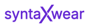

# SyntaxWear - Tênis e Sneakers Online 👟



A **SyntaxWear** é uma landing page moderna e responsiva focada no nicho de moda *Techwear*, especializada em tênis e sneakers de alto estilo. O projeto foi desenvolvido com foco em usabilidade, design limpo e uma estrutura de código organizada, ideal para quem está começando a explorar o mundo do desenvolvimento web.

---

## 🚀 Tecnologias Utilizadas

Este projeto foi construído utilizando as tecnologias fundamentais da web:

- **HTML5**: Estruturação semântica do conteúdo.
- **CSS3**: Estilização moderna utilizando variáveis, Flexbox e Grid Layout.
- **Google Fonts**: Integração das fontes 'Ubuntu' e outras variações para uma tipografia única.

---

## ✨ Funcionalidades

- **Design Responsivo**: O site se adapta a diferentes tamanhos de tela (computadores, tablets e celulares).
- **Menu Navegação**: Navegação intuitiva entre categorias (Masculino, Feminino, Outlet).
- **Banner Hero**: Destaque principal para o modelo "Krypton One".
- **Categorias**: Seção visual para navegar por estilos (Casual, Esporte, Moderno, Futurista).
- **Grid de Produtos**: Exibição organizada de modelos e imagens conceituais.
- **Newsletter**: Área no rodapé para captura de e-mails.
- **Links Sociais**: Integração visual com ícones de redes sociais (Instagram, WhatsApp, TikTok, Facebook).

---

## 📁 Estrutura de Pastas

A organização do projeto segue boas práticas de modularização para facilitar a manutenção:

```text
SyntaxWear/
├── index.html          # Página principal do site
├── css/                # Pasta de estilos
│   └── components/     # Componentes CSS separados por função
│       ├── base.css           # Estilos base de elementos
│       ├── variables.css      # Cores e fontes globais (variáveis)
│       ├── header.css         # Estilos do cabeçalho
│       ├── hero.css           # Estilos da seção principal
│       ├── product-grid.css   # Estilos da vitrine de produtos
│       └── ...                # Outros componentes
└── images/             # Pasta de recursos visuais
    ├── banners/        # Imagens grandes de destaque
    ├── icons/          # Ícones em formato SVG
    ├── logo/           # Logotipo oficial
    └── products/       # Fotos dos produtos (tênis)
```

---

## 🛠️ Como executar o projeto

Como este é um projeto de front-end estático (HTML e CSS), você não precisa instalar nada complexo!

1. **Clone ou baixe** este repositório para o seu computador.
2. Navegue até a pasta raiz do projeto.
3. Localize o arquivo `index.html`.
4. Clique duas vezes no arquivo ou arraste-o para o seu navegador de preferência (Chrome, Firefox, Edge, etc).

---

## 💡 Dicas para Iniciantes

Se você está aprendendo a programar e quer usar este projeto para praticar, aqui estão algumas sugestões:

- **Mude as cores**: Altere os valores das variáveis no arquivo `css/components/variables.css` para ver o site mudar instantaneamente.
- **Adicione novos itens**: Tente adicionar um novo card de categoria na seção `categories-section` no `index.html`.
- **Explore o Grid**: Veja como o arquivo `product-grid.css` organiza as imagens de forma dinâmica.

---

## 📄 Licença

Este projeto é para fins educativos e de portfólio. Sinta-se à vontade para usá-lo como base para seus estudos!

---
Desenvolvido com 💻 e ☕ por [Bruno](https://github.com/bruabsil).
